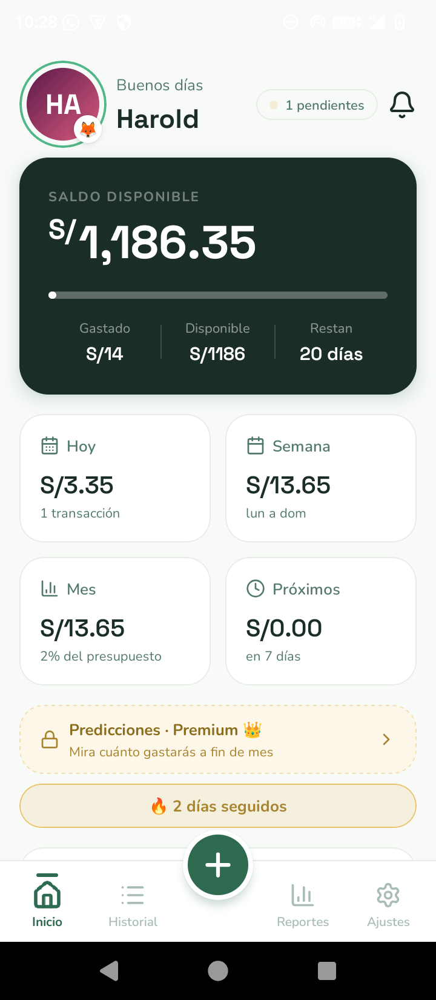
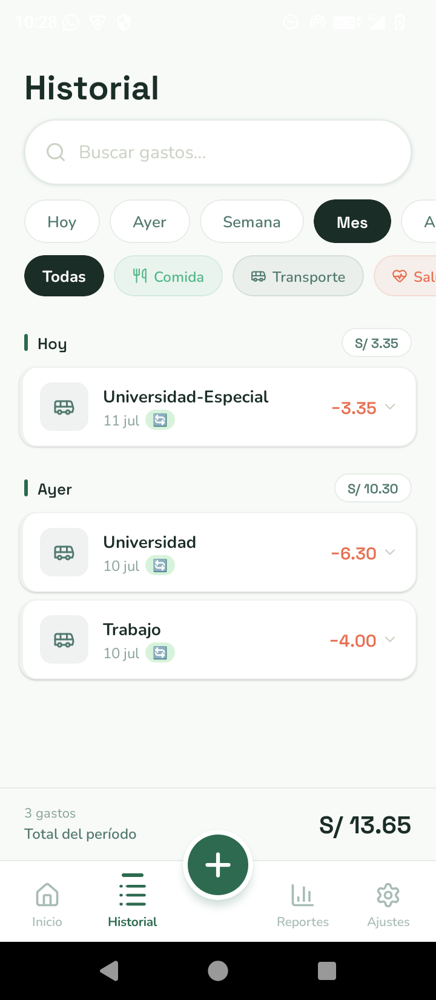
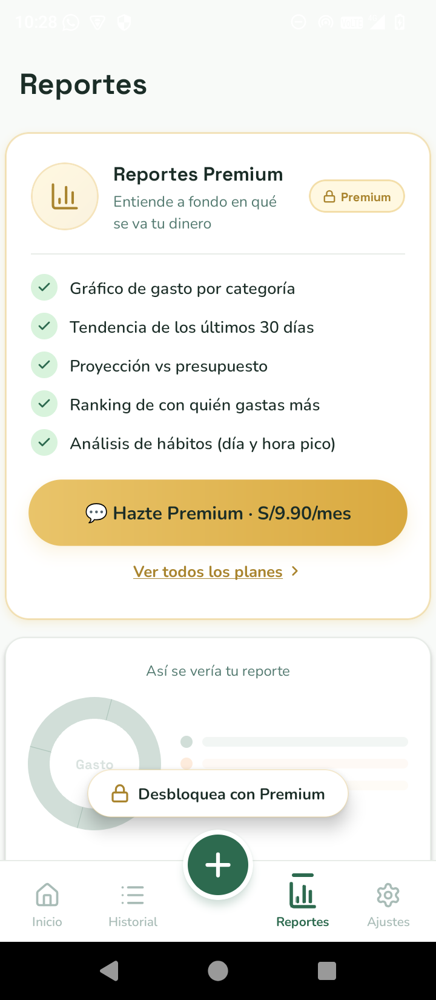
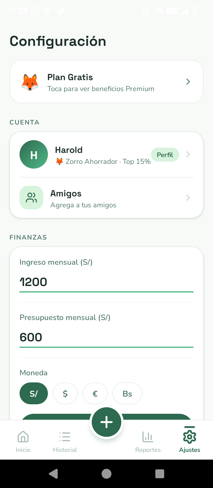
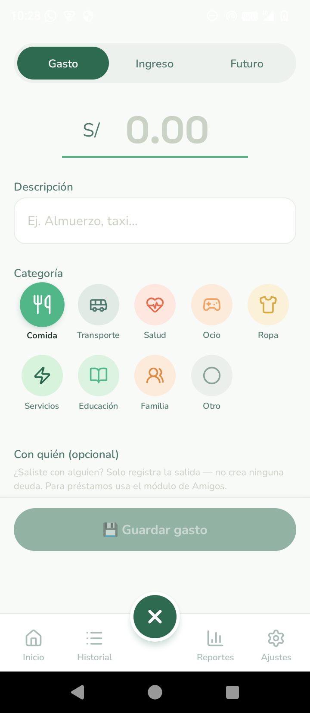

  

<h1 align="center">🦊 MisGastos</h1>

  App móvil de finanzas personales — React Native + Expo + Supabase 
  Offline-first, deudas entre amigos en tiempo real, notificaciones push, predicciones de gasto y modelo freemium.

---

## ⚠️ Sobre este repositorio

Este es un repositorio **público de portafolio**: contiene documentación, capturas y
explicación técnica del proyecto, pero **no incluye el código fuente**. El código vive
en un repositorio privado. Esto es intencional — la app está publicada en tiendas /
distribución directa y el código fuente no es de libre descarga.

¿Quieres ver el código, una demo en vivo, o hablar de una colaboración? Contáctame.

---

## Qué es

App móvil Android de gastos personales, **offline-first**: todo se guarda en SQLite
local y se sincroniza a Supabase (PostgreSQL) cuando hay red, vía patrón *outbox*.
Incluye deudas entre amigos conectados en tiempo real, notificaciones push,
integración con Google Sheets, predicciones de gasto, gamificación (logros/racha) y
modelo freemium (Gratis / Premium).

**Identidad visual:** verde bosque `#1B2D27`, mascota zorro 🦊, tipografía
Space Grotesk (títulos) + Nunito (cuerpo).

---

## Capturas de pantalla

| Inicio | Historial | Reportes |
|:---:|:---:|:---:|
|  |  |  |

| Ajustes | Nuevo gasto |
|:---:|:---:|
|  |  |

*Capturas tomadas directo del dispositivo, con datos reales de uso.*

---

## Funcionalidades principales

- **Dashboard**: saldo disponible, gastado/disponible/días restantes, resumen
  hoy/semana/mes, alertas predictivas.
- **Registro de gastos, ingresos y gastos futuros**, con categorías, autocomplete y
  gastos recurrentes (diario / días específicos / semanal / mensual, procesados
  automáticamente al abrir la app).
- **Historial** con filtros por periodo/categoría y swipe-to-delete.
- **Reportes**: gráfico de gasto por categoría, tendencia de 30 días, proyección
  vs. presupuesto, ranking de gasto compartido (función Premium).
- **Deudas entre amigos conectados bidireccionales**: una deuda entre dos cuentas es
  una sola fila compartida con perspectivas invertidas, sincronizada en tiempo real
  (Supabase Realtime) en ambos celulares sin recargar la app.
- **Amigos estilo red social**: búsqueda por nombre/@usuario/código de 8 caracteres,
  solicitudes de amistad (recibidas/enviadas), perfil público opcional.
- **Notificaciones push (FCM v1)**: 5 canales Android con vibración/color/importancia
  propios (resumen diario, alertas de presupuesto, deudas, amigos, recordatorios),
  con acciones rápidas (Ver/Pagar, Aceptar/Rechazar) directo desde la notificación.
- **Integración con Google Sheets**: conexión OAuth (PKCE) que crea automáticamente
  una hoja con pestañas Gastos/Ingresos/GastosFuturos/Amigos/Config y sincroniza cada
  movimiento.
- **Gamificación**: racha de días seguidos registrando gastos, logros ("Zorro
  Ahorrador · Top 15%").
- **Modelo freemium**: plan Gratis (límite de recurrentes/amigos) y Premium
  (predicciones, reportes avanzados, Sheets, export), con activación manual vía
  Supabase y notificación push instantánea al desbloquear.
- **OTA updates** (EAS Update): mejoras y fixes se entregan sin pasar por la store.

---

## Stack técnico

| Capa | Tecnología |
|------|-----------|
| Framework | Expo SDK 51 · Expo Router v3 (file-based routing) |
| Runtime | React Native 0.74 · Hermes |
| Lenguaje | TypeScript estricto |
| Estilos | `StyleSheet.create()` puro |
| Estado global | Zustand 4 |
| Estado servidor | @tanstack/react-query v5 |
| Base de datos local | expo-sqlite (WAL) — offline-first |
| Backend | Supabase (PostgreSQL + REST + Realtime + Edge Functions) |
| Notificaciones | expo-notifications + FCM HTTP v1 (Edge Function en Deno) |
| Animaciones | react-native-reanimated v3 |
| Gráficos | victory-native (SVG) |
| Iconos | lucide-react-native |
| OTA | expo-updates + EAS Update |
| Builds | EAS Build (cloud) |

---

## Arquitectura de datos (resumen)

- **Offline-first**: cada acción (gasto, deuda, pago) se escribe primero en SQLite
  local y se encola en un *outbox*; un worker sincroniza contra Supabase cuando hay
  red, con reintentos.
- **Realtime bidireccional**: cambios en deudas/planes/solicitudes de amistad llegan
  al celular del otro usuario en segundos vía Supabase Realtime, sin cerrar/abrir la
  app.
- **Emparejamiento anti-colisión**: las deudas conectadas se emparejan por teléfono
  normalizado (últimos 9 dígitos), no por nombre, para evitar cruces entre usuarios
  con nombres iguales.

---

## Seguridad y privacidad de este repo

- El código fuente completo vive en un repositorio **privado** (backup + desarrollo).
- Este repositorio público **no acepta pull requests de código** — es solo
  documentación.
- Las capturas usan datos reales de una cuenta de prueba; no exponen credenciales,
  tokens ni información de terceros.

---

Proyecto personal en desarrollo activo — 2026.

